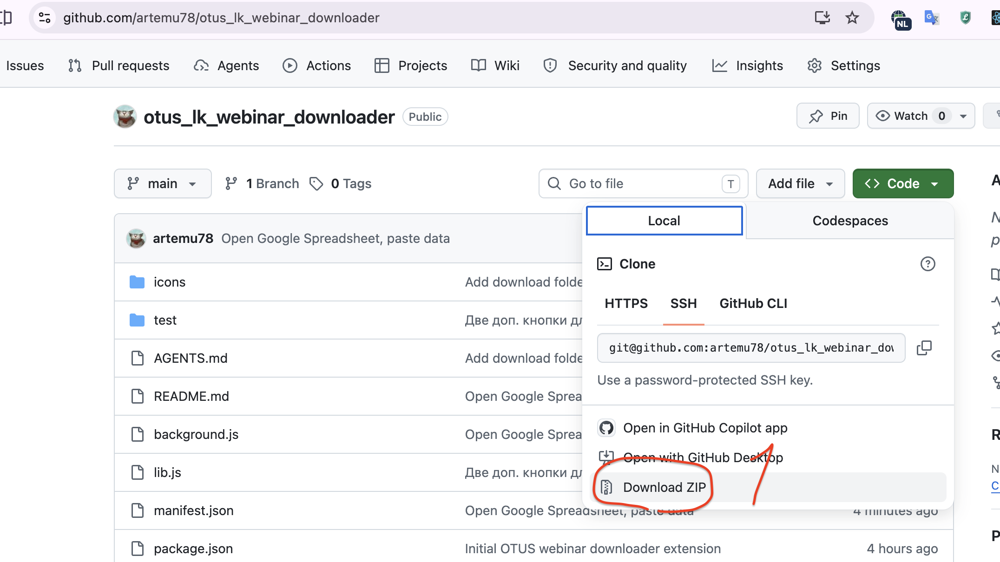
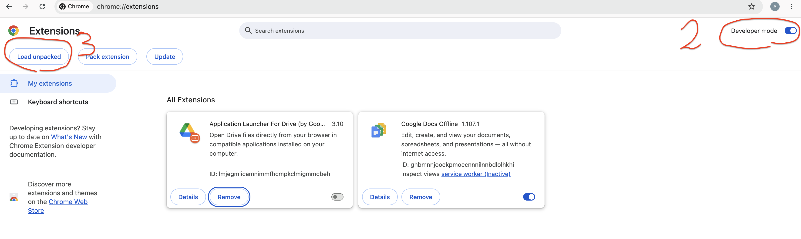
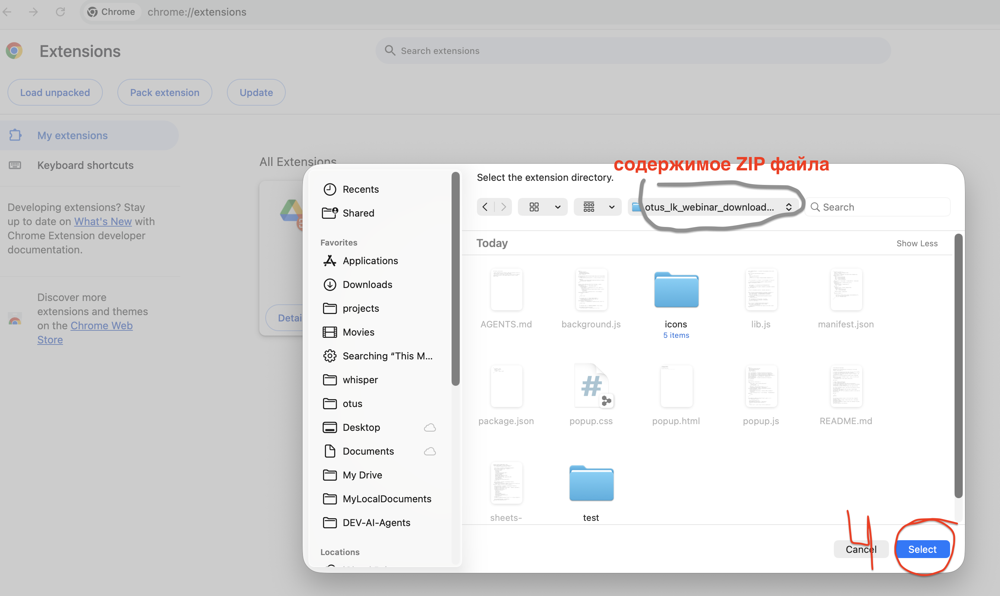
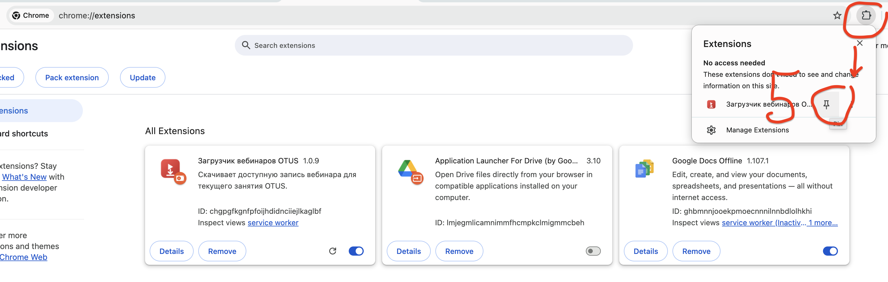
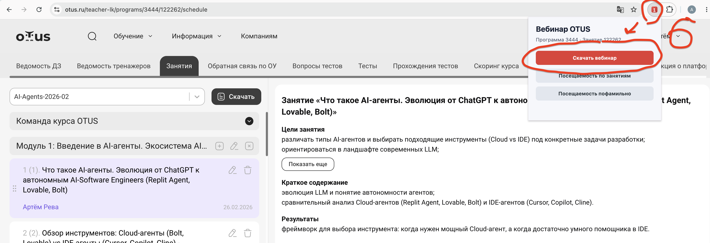

# Otus Teacher Helper

Расширение для Chrome на базе Manifest V3, не требующее установки зависимостей. На странице занятия преподавателя OTUS оно:

1. Извлекает идентификаторы программы и занятия из URL-адреса активной вкладки.
2. Получает данные занятия через API, используя текущую авторизованную сессию.
3. Выбирает первый доступный всем элемент с записью вебинара (`type === "webinar"` и `is_private === false`).
4. Запускает скачивание записи через Chrome Downloads API.
5. Формирует один из двух отчётов о посещаемости, копирует его в формате TSV и открывает новую Google Таблицу с краткой инструкцией по вставке данных.
6. На странице домашней работы находит курс, группу и фамилию студента, а затем просит локальный сервер открыть соответствующую папку в Finder или Warp, скачать туда GitHub-репозиторий либо прочитать последний TXT-отчёт из `analyze_result` и вставить его в первое текстовое поле страницы.

## Как установить

### 1. Скачайте расширение

На странице репозитория нажмите **Code**, затем **Download ZIP**. Распакуйте скачанный архив.



### 2. Откройте страницу расширений Chrome

Перейдите по адресу `chrome://extensions`, включите **Режим разработчика** и нажмите **Загрузить распакованное расширение**.



### 3. Выберите папку расширения

В открывшемся окне выберите папку с содержимым распакованного ZIP-архива и нажмите **Выбрать**.



### 4. Закрепите расширение

Откройте меню расширений Chrome и нажмите значок булавки рядом с расширением **Otus Teacher Helper**, чтобы его значок всегда отображался на панели браузера.



### 5. Откройте занятие в OTUS

Авторизуйтесь в OTUS и откройте страницу занятия с адресом вида `https://otus.ru/teacher-lk/programs/3616/127815/...`. Нажмите значок расширения и выберите нужное действие.



При формировании любого из отчётов о посещаемости дождитесь, пока расширение соберёт данные программы. Готовая таблица будет скопирована в буфер обмена, после чего откроется новая Google Таблица. Выберите ячейку `A1` и вставьте данные с помощью **Cmd+V** в macOS или **Ctrl+V** в Windows/Linux.

## Локальный сервер для действий с домашней работой

Chrome не может самостоятельно открывать произвольные локальные папки. Перед
использованием кнопок для папки студента запустите отдельный локальный
сервер из корня репозитория:

```sh
cp .env.example .env
# Откройте .env и замените OPENROUTER_API_KEY на свой ключ.
npm run local-server
```

Файл `.env` обязателен для запуска локального сервера и не попадает в Git.
Шаблон `.env.example` содержит адрес OpenRouter и модель; в созданном `.env`
необходимо указать собственный `OPENROUTER_API_KEY`. Если файл отсутствует или
обязательные значения пусты, сервер завершится с инструкцией по настройке.

Кнопка отображается на страницах вида
`https://otus.ru/teacher-lk/homework/170836/47369`. Расширение получает группу и
фамилию через API OTUS и передаёт код группы, фамилию и номер домашней
работы локальному серверу. Полученный абсолютный путь сохраняется в
`localStorage` расширения под ключом
`owd/homework-folder/<studentId>/<homeworkId>`. Префикс `owd/` отделяет записи
расширения от остальных данных. Последующие
действия используют этот путь без повторного запроса группы; скачивание
материалов всё равно запрашивает чат, потому что из него извлекается GitHub-ссылка.
Сервер строит платформо-зависимый путь от `DEFAULT_ALLOWED_ROOT`, заданного в `.env`.

Сервер слушает только `127.0.0.1:8765`, принимает ограниченный набор команд,
незаметно создаёт отсутствующую папку и разрешает открывать только пути внутри
`DEFAULT_ALLOWED_ROOT`. Подробности и настройки находятся в
[`local-server/README.md`](local-server/README.md).

Вложения типов PDF, DOC, DOCX, MD, XLS и XLSX из сообщений студента расширение
получает с текущей авторизованной Chrome-сессией и сохраняет в папку домашней
работы студента; ссылки и вложения
преподавателя оно игнорирует. Для остальных материалов сервер отправляет только
сообщения студента в модель
`deepseek/deepseek-v4-flash` через OpenRouter. Если найдена HTTPS-ссылка на ZIP,
расширение скачивает архив с текущей авторизованной Chrome-сессией, а локальный
сервер распаковывает его в папку студента без перезаписи существующих файлов,
отклоняя опасные пути и символические ссылки. Иначе он проверяет найденный GitHub URL и
клонирует репозиторий по SSH через alias из `GITHUB_SSH_HOST`. Значение
`artemreva-hub` соответствует одноимённому блоку `Host` в `~/.ssh/config`.
UI-ссылки вида
`https://github.com/owner/repository/` преобразуются в `owner/repository`. Для ссылки на PR
через `gh` определяется исходный репозиторий ветки, включая fork. Целевая папка
должна быть пустой; для GitHub `gh` должен быть установлен и авторизован.

Диагностика скачивания выводится в терминал локального сервера строками с
префиксом `[student-materials]`: там видны этапы OpenRouter, распознанный URL,
разрешение PR/fork, SSH clone URL, итог или ошибка. API-ключ и тексты сообщений
студента не логируются.

## Безопасность

Все данные о занятии и посещаемости извлекаются через API OTUS, используя текущую авторизованную сессию. Расширение не хранит и не передаёт эти данные. Все преобразования выполняются локально в браузере, а готовый отчёт копируется в буфер обмена и открывается в новой Google Таблице.

## Как запустить тесты

```sh
npm test
```

Расширение запрашивает доступ к активной вкладке, записи в буфер обмена, загрузкам Chrome, хранилищу данных сессии, страницам `https://otus.ru/*`, локальному серверу `http://127.0.0.1:8765/*` и Google Таблицам. Контент-скрипт для Google Таблиц только показывает инструкцию по вставке данных в новой таблице, открытой расширением.

## Обратная связь

Замечания и проблемы сюда:
https://github.com/artemu78/otus_lk_webinar_downloader/issues
